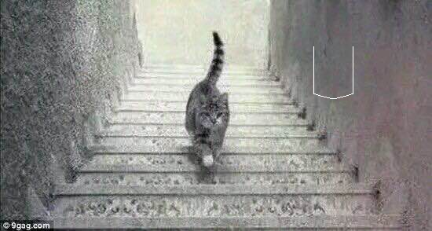
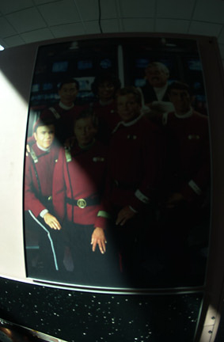
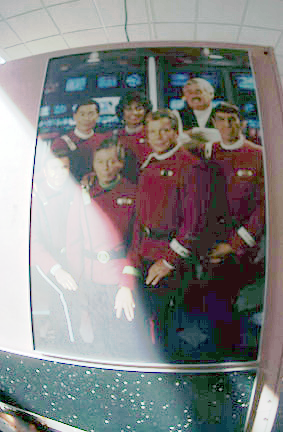
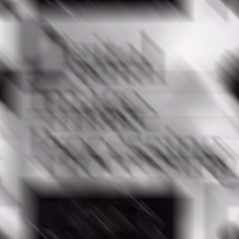
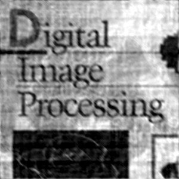

# Digital-Image-Processing
## **experiment 1 Noising & Filtering**
+ Preparation – adding noise to board-orig.bmp:
   + Noise 1: Salt&Pepper (25%)
   + Noise 2: Gauss(20%,m=20,viarance=400)

+ Methods to be developed and tested:
   + Alpha-trimmed mean filter 
   + Adaptive median filter
+ Evaluation of results

## **experiment 2 Canny Edge Detector**
+ Results of my detector
  
  (1) Lena

  &emsp;&emsp;
  

  (2) house

  &emsp;&emsp;
  

## **experiment 3 Texture Descriptors**
+ Co-occurrence matrix (共生矩阵)
+ 不变矩 $\psi_1$ ~ $\psi_7$

## **Project 1 BMP Loading and Interpolation**
+ Task1:
1) Read and display “Up or Down.bmp” file
2) Write “U” or “D” into this Bmp as your answer
3) Save 2) as an answer.bmp

+ Task2:
&emsp;For tsukuba-left.bmp(gray, 8bits/pixels, 384*288 pixels)
1) Bicubic interpolation into 1152*864 pixels
2) Rotate +35 degree

## **Project 3 Filtering in Frequency Domain**
+ Homomorphic Filtering (同态滤波器)
+ DFT and IDFT **myDFT2.m, myIDFT2.m** 
+ Histogram equalization (直方图均衡) **myhisteq.m**

&emsp;&emsp;

## **Project 4 Constrained Least Squares Filtering**
+ Task
  
  (1)  Image blurring by Motion Model:
  
  Input：ImageOrg & H, a=0.1, b=0.1 and T=1
  
  Output：ImageBlur
  
  (2)  Constrained Least Squares Filtering
  
  Input：ImageBlur & H, a=0.1, b=0.1 and T=1, you may estimate $σ^2+μ^2$
  
  Output：ImageOrg

+ Result
  
  *Origin Picture*

  

  *Blurred Picture*
  
  

  *Recovered Picture*
  
  